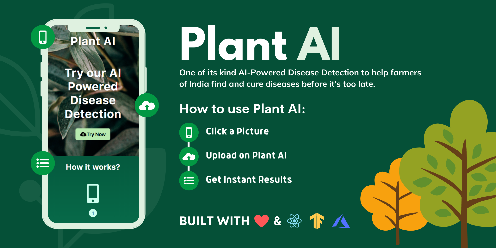

# Greenathon-Plant-AI🌱 [](https://twitter.com/intent/tweet?text=Wow:&url=https%3A%2F%2Fgithub.com%2FRishit-dagli%2FGreenathon-Plant-AI)

[](https://www.plant-ai.tech/)
[](https://tfhub.dev/rishit-dagli/plant-disease/)
[](https://github.com/Rishit-dagli/Greenathon-Plant-AI/actions/workflows/azure-static-web-apps-mango-forest-0c00d3400.yml)
[](https://github.com/Rishit-dagli/Greenathon-Plant-AI/actions/workflows/linter.yml)

[](LICENSE)
[](https://github.com/Rishit-dagli/Greenathon-Plant-AI/stargazers)
[](https://github.com/Rishit-dagli/Greenathon-Plant-AI/network/members)

This is a web application🌐 which could help easily diagnose diseases in plants
🌱 using Machine Learning all on the web, powered by TensorFlow JS. 

***You can use and test the latest web app from below 👇***

[](http://www.plant-ai.tech/)

## About 🔮

- Creates a TensorFlow Model for identifying plant diseases
- Creates optimized TensorFlow JS Models
- Uses TensorFlow JS to perform inferences on-device
- Creates a fully functional web app using React
- Exposes a hosted API built with TensorFlow Serving for inferences from the TensorFlow Model

## UI Design 🎨

Click to View Plant AI web app Design from below

[](https://www.figma.com/file/RbfBDLPgNNTtLp5xmvJEEH/Plant-AI-Hackathon-Website)

## About the Notebooks

### [`plant-diseases-training.ipynb`](notebooks/plant-diseases-training.ipynb)
[](https://colab.research.google.com/github/Rishit-dagli/Greenathon-Plant-AI/blob/main/notebooks/plant-diseases-training.ipynb)
[](https://mybinder.org/v2/gh/Rishit-dagli/Greenathon-Plant-AI/HEAD?filepath=notebooks%2Fplant-diseases-training.ipynb)

This notebook contains the code to train a model on the [PlantVillage dataset](http://arxiv.org/abs/1511.08060)
to identify diseases from plant images. Here we provide a subset of our 
experiments on working with this data. Finally we export our model as a 
TensorFlow `SavedModel`.

### [`plant_diseases_TFJS.ipynb`](notebooks/plant_diseases_TFJS.ipynb)
[](https://colab.research.google.com/github/Rishit-dagli/Greenathon-Plant-AI/blob/main/notebooks/plant_diseases_TFJS.ipynb)
[](https://mybinder.org/v2/gh/Rishit-dagli/Greenathon-Plant-AI/HEAD?filepath=notebooks%2Fplant_diseases_TFJS.ipynb)

This notebook shows the the process of converting the TensorFlow `SavedModel` we built in the prequel notebook to the TFJS format for the Plant AI model. It 
also shows performing optimizations on this.

### [`plant_diseases_TFLite.ipynb`](notebooks/plant_disease_TFLite.ipynb)
[](https://colab.research.google.com/github/Rishit-dagli/Greenathon-Plant-AI/blob/main/notebooks/plant_disease_TFLite.ipynb)
[](https://mybinder.org/v2/gh/Rishit-dagli/Greenathon-Plant-AI/HEAD?filepath=notebooks%2Fplant_diseases_TFLite.ipynb)

This notebook shows the the process of converting the TensorFlow `SavedModel` we built in the prequel notebook to the TF Lite format for the Plant AI model.

## Run Locally

To get up and running with this web-app, run the following commands, make sure 
you have [Node.js](http://nodejs.org/) installed. This runs the app in 
development mode:

```sh
git clone https://github.com/Rishit-dagli/Greenathon-Plant-AI # or clone your own fork
cd Greenathon-Plant-AI
npm install
npm start
```

<!-- markdown-link-check-disable-next-line -->
Your app should now be running on [localhost:3000](http://localhost:3000) :rocket:.

## Lint ✅
This project uses [***GitHub Super Linter***](https://github.com/github/super-linter) which is Combination of multiple linters to install as a GitHub Action.

Following Linters are used internally by super linter (enabled for this project):
- JavaScript: [eslint](https://eslint.org/)
- CSS: [stylelint](https://stylelint.io/)
- HTML: [HTMLHint](https://github.com/htmlhint/HTMLHint)
- JSON: [jsonlint](https://github.com/zaach/jsonlint)
- YAML: [YamlLint](https://github.com/adrienverge/yamllint)

## Want to Contribute 🙋‍♂️?

Awesome! If you want to contribute to this project, you're always welcome! See [Contributing Guidelines](CONTRIBUTING.md). You can also take a look at [Greenathon-Plant-AI's Project Status Tracker](https://github.com/Rishit-dagli/Greenathon-Plant-AI/projects/1) for getting more information about current or upcoming tasks.

## Want to discuss? 💬

Have any questions, doubts or want to present your opinions, views? You're always welcome. You can [start discussions](https://github.com/Rishit-dagli/Greenathon-Plant-AI/discussions).

## Contributors

- [Rishit Dagli](https://github.com/Rishit-dagli)
- [Rishabh Singh](https://github.com/mindninjaX)
- [Rucha Yagnik](https://github.com/RuchaYagnik)

## Citations

```bibtex
@misc{hughes2016open,
      title={An open access repository of images on plant health to enable the development of mobile disease diagnostics}, 
      author={David. P. Hughes and Marcel Salathe},
      year={2016},
      eprint={1511.08060},
      archivePrefix={arXiv},
      primaryClass={cs.CY}
}
```

## License

```
Copyright 2020 Rishit Dagli

Licensed under the Apache License, Version 2.0 (the "License");
you may not use this file except in compliance with the License.
You may obtain a copy of the License at

    http://www.apache.org/licenses/LICENSE-2.0

Unless required by applicable law or agreed to in writing, software
distributed under the License is distributed on an "AS IS" BASIS,
WITHOUT WARRANTIES OR CONDITIONS OF ANY KIND, either express or implied.
See the License for the specific language governing permissions and
limitations under the License.
```
