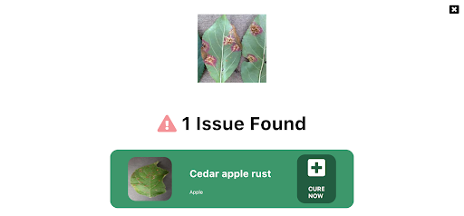
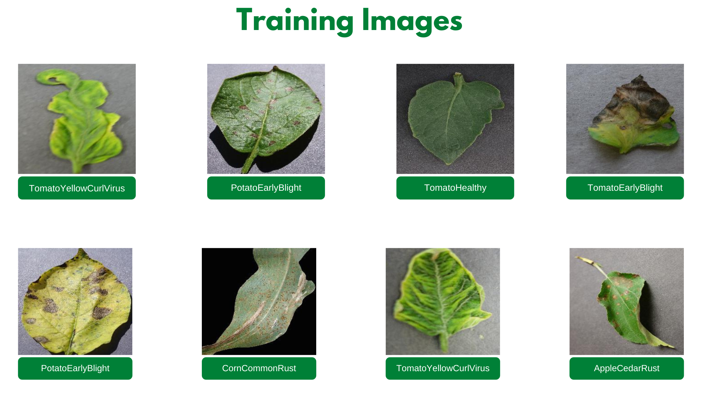

# Project Plant AI


Hello developers 👋! In this article, we introduce our project “Plant AI ☘️” and walk you through our motivation behind building this project, how it could be helpful to the community, the process of building this project, and finally our future plans with this project.

Plant AI ☘️ is a web application 🌐 that helps one to easily diagnose diseases in plants from plant images, using Machine Learning possible all on the web. We provide an interface on the website where you can simply upload images of your plant leaves since we majorly focus on plant leaf diseases and instantly know diseases the plant has. We further also provide users easy ways to solve the diagnosed disease.

<!-- markdown-link-check-disable-next-line -->
> As of now our model supports 38 categories of healthy and unhealthy plant images across species and diseases. The complete list of supported diseases and species can be found [here](https://coverimages.blob.core.windows.net/plantai-tfjs-model/labels.txt). In case you are looking for an image to test this out, find one testing image [here](https://drive.google.com/drive/folders/13gjzw--osiXXZdIrhtyzB6WvCtHY36Wj?usp=sharing)

Guess, what? This project is also completely open-sourced⭐, here is the GitHub repo for this project: https://github.com/Rishit-dagli/Greenathon-Plant-AI

## The motivation behind building this

Human society needs to increase food production by an estimated 70% by 2050 to feed an expected population size that is predicted to be over 9 billion people [1]. Currently, infectious diseases reduce the potential yield by an average of 40% with many farmers in the developing world experiencing yield losses as high as 100%.

The widespread distribution of smartphones among crop growers around the world with billions of crop growers having smartphones offers the potential of turning the smartphone into a valuable tool for diverse communities growing food.

Our motivation with this web app was to solve this problem by aiding crop growers by turning their smartphones into an easy diagnosis tool that could help increase the yield substantially and reduce crop failures. We also aim to make this rather easy for crop growers so this tool could be used on a daily basis.

## How does this work?

As we highlighted in the previous section, our main target audience with this project is crop growers and we aim that they use this on a daily basis to diagnose disease from their plant images, maybe in an autonomous fashion too.

Our application majorly relies on the Machine Learning Model we built to identify plant diseases from images. We first built this Machine Learning model using TensorFlow and Azure Machine Learning to keep track, orchestrate and perform our experiments in a well-defined manner. A subset of our experiments used to build the current model have also been open-sourced and can be found on [the project’s GitHub repo](https://github.com/Rishit-dagli/Greenathon-Plant-AI).

After doing so we were also quite interested in running this Machine Learning model on mobile devices or smartphones too, to further amplify its use. We use TensorFlow JS to optimize our model and allow it to work on the web for devices that are less compute-intensive.

Further, we also optimize this model to work on embedded devices with TensorFlow Lite further expanding the usability of this project and also provide a hosted model API built using TensorFlow Serving and hosted with Azure Container Registry and Azure Container Instances.

We talk about the Machine Learning aspect and our experiments in greater detail in the upcoming sections.


<p align="center">
    The model in action
</p>

To allow plant growers to easily use this, we also provide a fully functional web app built with React and hosted on Azure Static Web Apps. This web app allows you to try using the Machine Learning model and identify diseases from plant images all on the web. You can try out this web app right away - https://www.plant-ai.tech/ and try uploading a plant image to our model. In case you want to test out this web app we also provide a couple of [real-life plant images](https://drive.google.com/drive/folders/13gjzw--osiXXZdIrhtyzB6WvCtHY36Wj?usp=sharing) you could use.

As we mentioned earlier we expect most of the traffic and usage of our project from mobile devices, consequently, the Machine Learning model we run through the web app is optimized to run on the client-side.

This also enables us to have blazing fast performance with our ML model. We use this model on the client-side with TensorFlow JS APIs which further also allows us to boost performance with a WebGL backend.

The below sections talk about how we built this project in greater detail and we also explain the reason behind some decisions we made for the project and how we worked on each of the features you saw earlier.

## Building the Machine Learning Model

Building the Machine Learning Model is a core part of our project consequently we spent quite some time experimenting and building the Machine Learning Model for this project. We had to build a machine learning model that:
- gives acceptable performance
- not too heavy since we want to run the model on low-end devices

### Training the model

We train our model on the Plant Village dataset [2] on about 87,000 (+ augmented images) healthy and unhealthy leaf images. These images were classified into thirty-eight categories based on species and diseases. Here are a couple of images the model was trained on:



We experimented with quite a few architectures and even tried building our own architectures from scratch using Azure Machine Learning to keep track, orchestrate and perform our experiments in a well-defined manner.

It turned out that transfer learning on top of MobileNet [3] was indeed quite promising for our use case. The model we built doing gave us the acceptable performance and was also close to twelve megabytes ins size, not a heavy one. Consequently, we built a model on top of MobileNet using initial weights from MobileNet trained on ImageNet [4].

We also have made a subset of our experiments used to train the final model public through this project’s GitHub repository.

### Running the model on browser

We now had a TensorFlow SavedModel trained and ready to be used. As mentioned earlier in this article we are also interested in performing Machine Learning on the client-side on the browser. To do so in a consistent and easy manner we use [TensorFlow JS](https://www.tensorflow.org/js/).

To use our model with TensorFlow JS on the browser, we first needed to convert our model to the TFJS format. Fortunately, this was quite easy for us to do with the [TensorFlow JS converter](https://www.tensorflow.org/js/) which allowed us to easily convert our TensorFlow SavedModel to TFJS format. The TensorFlow JS Converter further also optimizes the model for being served on the web by sharding the weights into 4MB files so that they can be cached by browsers. It also attempts to simplify the model graph itself using [Grappler](https://github.com/tensorflow/tensorflow/tree/master/tensorflow/core/grappler) such that the model outputs remain the same. Graph simplifications often include folding together adjacent operations, eliminating common subgraphs, etc.

After doing so our TFJS format model has the following files, which would be loaded on the web app:
- `model.json` (the dataflow graph and weight manifest)
- `group1-shard\*of\*` (collection of binary weight files)

Now that we have our TFJS model ready to be used, we wanted to allow us to run the TFJS model on browsers. To do so we again made use of the TensorFlow JS Converter that includes an API for loading and executing the model in the browser with TensorFlow.js🚀. We are excited to run our model on the client-side since this ability to run deep networks on personal mobile devices improves user experience, offering anytime, anywhere access, with additional benefits for security, privacy, and energy consumption.

### Consuming the trained model

We are very excited to see how the community uses our project as a whole and also our Machine Learning models. Thus, we make it super easy for you to consume our trained models. To do so we recommend you to use our models from [TensorFlow Hub](https://www.tensorflow.org/hub) which allows you to reuse our models very easily with a few lines of code and save you from manual work.

> To use the SavedModel we expect you to have installed [TensorFlow Hub](https://www.tensorflow.org/hub/installation).

The TensorFlow SavedModel can be easily used with `hub.load` as:

```py
model = hub.load("https://tfhub.dev/rishit-dagli/plant-disease/1")
```

The output is a batch of logits vectors. The indices into the logits are the `num_classes = 38` classes of the classification from the original training (see above). The mapping from indices to class labels can be found in the file at https://github.com/Rishit-dagli/Greenathon-Plant-AI/releases/download/v0.1.0/class_indices.json with each label in the following format: `${SPECIES}__${DISEASE}`. In case the disease name consists of two words it would be in the following format: `${DISEASE_WORD_1}_${DISEASE_WORD_2}`

The input images are expected to have color values in the range `[0,1]`, following the [common image input](https://www.tensorflow.org/hub/common_signatures/images#input) conventions. The expected size of the input images is height x width = 224 x 224 pixels by default, but other input sizes are possible (within limits).

You could also directly consume our TFJS model from TensorFlow Hub as:

```js
tf.loadLayersModel("https://tfhub.dev/rishit-dagli/tfjs-model/plant-disease/default/1", { fromTFHub: true })
```

### Hosted Model API

To further make our model even more accessible and usable to others in the community we also provide a hosted model API built with [TensorFlow Serving](https://www.tensorflow.org/tfx) and hosted with Azure Container Instances at this stage. This makes it easier than ever to use our model, now just a single API call away!🚀

## Designing the web app

One of our major aims while building Plant AI was to make high-quality disease detection accessible to most crop growers. To do so we had to design the web app in a manner that it was easy enough to use this project on a daily basis and also be accessible to all. Thus, we decided to build Plant AI in the form of a web app to make it easily accessible and usable by crop growers.

As mentioned earlier, the design and UX of our project is focused on ease of use and simplicity. The basic frontend of Plant AI contains just a minimal landing page and two other subpages. All pages were designed using custom reusable components, improving the overall performance of the web app and helping keep the design consistent across the web app.

While designing Plant AI, we aimed at the above mentioned best practices so the first thing we did is to get a UI/UX wireframe.

[](https://www.figma.com/file/RbfBDLPgNNTtLp5xmvJEEH/Plant-AI-Hackathon-Website)

## Building and hosting the web app

Once the UI/UX wireframe was ready and a frontend structure was available for further development, we worked to transform the Static React Application into a Dynamic web app. The idea was to provide an easy and quick navigation experience throughout the web app. For this, we linked the different parts of the website in such a manner that all of them were accessible right from the home page.


<p align="center">
Web landing page
</p>

Since our application is built with React, we already had a state management library with our application which integrates quite well with React packages and is well documented. By state, we here refer to the UI state and use it to control interactive parts of the web app. We managed the state using a React hook, `useState`. This hook allows us to preserve some state variables across multiple function calls and easily make edits too.

The `useState` hook is often perfect for small amounts of local component state. This was a perfect choice for our web app, thus we manage state using `useState`.

We then worked on running the Machine Learning model on the web app. Fortunately, we had already worked on optimizing our models to run on the client-side on the web using the TFJS Converter. We load our model from Azure Blob Storage, and model weights are also loaded as sharded 4MB files so that they can be cached by browsers.

Once we can access the models we load them using TFJS converter model loading APIs by making individual HTTP(S) requests for loading the model.json file (the dataflow graph and weight manifest) and the sharded weight file in the mentioned order. This approach allows all of these files to be cached by the browser (and perhaps by additional caching servers on the internet) because the model.json and the weight shards are each smaller than the typical cache file size limit. Thus a model is likely to load more quickly on subsequent occasions.

We first normalize our images that is to convert image pixel values from 0 to 255 to 0 to 1 since our model has a MobileNet backbone. After doing so we resize our image to 244 by 244 pixels using nearest neighbor interpolation though our model works quite well on other dimensions too. After doing so we use the TensorFlow JS APIs and the loaded model to get predictions on plant images.

Hosting the web app we built was made quite easy for us using Azure Static Web Apps. This allowed us to easily set up a CI/ CD Pipeline and Staging slots with GitHub Actions (Azure's Static Web App Deploy action) to deploy the app to Azure. With Azure Static Web Apps, static assets are separated from a traditional web server and are instead served from points geographically distributed around the world right out of the box for us. This distribution makes serving files much faster as files are physically closer to end users.

## Future Ideas

We are always looking for new ideas or addressing bug reports from the community. Our project is completely open-sourced and we are very excited if you have some feedback, feature request, or a bug report apart from the ones we mention here, please consider contributing to this project by creating an issue or a Pull Request on our [GitHub repo](https://github.com/Rishit-dagli/Greenathon-Plant-AI/issues)!

One of the top ideas we are working on as of now is transforming our web app into a progressive web app to allow us to take advantage of features supported by modern browsers like service workers and web app manifests. We are working on this to allow us to support:
- Offline mode
- Improve performance, using service workers
- Use platform-specific features, which would allow us to send push notifications and use location data to better help crop growers
- Considerably less bandwidth usage

As of now, we present a web app that we feel would be the major way of using our project. However, we are also quite interested in pairing this with existing on-field cameras and thus make it quite useful for certain crop growers.

Another idea we are currently working on which is quite straightforward to implement is about adding accounts and keeping a track of images the user has run this model on. Currently, we do not store any info about the images uploaded. It would be quite useful to track images added by farmers and store info about disease stats for crops in a designated piece of land on which we could model our suggestion to cure the disease. And would be quite helpful for crop growers.

## Thank you for reading!

As we mentioned earlier, we are very excited to hear from you, the awesome community about how we could do better, and are looking for feedback! If you find our project useful and want to support us; consider giving a star ⭐ on the project’s [GitHub repo](https://github.com/Rishit-dagli/Greenathon-Plant-AI).

Many thanks to [Ali Mustufa Shaikh](https://github.com/ialimustufa) and [Jen Looper](https://github.com/jlooper) for helping me to make this better :)

## Citations

[1] Alexandratos, Nikos, and Jelle Bruinsma. “World Agriculture towards 2030/2050: The 2012 Revision.” AgEcon Search, 11 June 2012, doi:10.22004/ag.econ.288998.

[2] Hughes, David P., and Marcel Salathe. “An Open Access Repository of Images on Plant Health to Enable the Development of Mobile Disease Diagnostics.” ArXiv:1511.08060 [Cs], Apr. 2016. arXiv.org, http://arxiv.org/abs/1511.08060.

[3] Howard, Andrew G., et al. “MobileNets: Efficient Convolutional Neural Networks for Mobile Vision Applications.” ArXiv:1704.04861 [Cs], Apr. 2017. arXiv.org, http://arxiv.org/abs/1704.04861.

[4] Russakovsky, Olga, et al. “ImageNet Large Scale Visual Recognition Challenge.” ArXiv:1409.0575 [Cs], Jan. 2015. arXiv.org, http://arxiv.org/abs/1409.0575.
