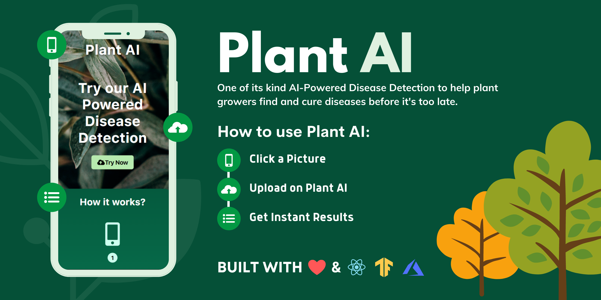

# Project Plant AI

Hello developers 👋! In this article, we introduce our project “Plant AI ☘️” and walk you through our motivation behind building this project, how it could be helpful to the community, the process of building this project, and finally our future plans with this project.

Plant AI ☘️ is a web application 🌐 that helps one to easily diagnose diseases in plants from plant images, using Machine Learning possible all on the web. We provide an interface on the website where you can simply upload images of your plant leaves since we majorly focus on plant leaf diseases and instantly know diseases the plant has. We further also provide users easy ways to solve the diagnosed disease.

Guess, what? This project is also completely open-sourced⭐, here is the GitHub repo for this project: https://github.com/Rishit-dagli/Greenathon-Plant-AI

## The motivation behind building this

Human society needs to increase food production by an estimated 70% by 2050 to feed an expected population size that is predicted to be over 9 billion people [1]. Currently, infectious diseases reduce the potential yield by an average of 40% with many farmers in the developing world experiencing yield losses as high as 100%.

The widespread distribution of smartphones among crop growers around the world with billions of crop growers having smartphones offers the potential of turning the smartphone into a valuable tool for diverse communities growing food.

Our motivation with this web app was to solve this problem by aiding crop growers by turning their smartphones into an easy diagnosis tool that could help increase the yield substantially and reduce crop failures. We also aim to make this rather easy for crop growers so this tool could be used on a daily basis.

## How does this work?

As we highlighted in the previous section, our main target audience with this project is crop growers and we aim that they use this on a daily basis to diagnose disease from their plant images, maybe in an autonomous fashion too.

Our application majorly relies on the Machine Learning Model we built to identify plant diseases from images. We first built this Machine Learning model using TensorFlow and Azure Machine Learning to keep track, orchestrate and perform our experiments in a well-defined manner. A subset of our experiments used to build the current model have also been open-sourced and can be found on [the project’s GitHub repo](https://github.com/Rishit-dagli/Greenathon-Plant-AI).

After doing so we were also quite interested in running this Machine Learning model on mobile devices or smartphones too, to further amplify its use. We use TensorFlow JS to optimize our model and allow it to work on the web for devices that are less compute-intensive.

Further, we also optimize this model to work on embedded devices with TensorFlow Lite further expanding the usability of this project and also provide a hosted model API built using TensorFlow Serving and hosted with Azure Container Registry and Azure Container Instances.

We talk about the Machine Learning aspect and our experiments in greater detail in the upcoming sections.

    The model in action

To allow plant growers to easily use this, we also provide a fully functional web app built with React and hosted on Azure Static Web Apps. This web app allows you to try using the Machine Learning model and identify diseases from plant images all on the web. You can try out this web app right away - https://www.plant-ai.tech/ and try uploading a plant image to our model. In case you want to test out this web app we also provide a couple of [real-life plant images](https://drive.google.com/drive/folders/13gjzw--osiXXZdIrhtyzB6WvCtHY36Wj?usp=sharing) you could use.

As we mentioned earlier we expect most of the traffic and usage of our project from mobile devices, consequently, the Machine Learning model we run through the web app is optimized to run on the client-side.

This also enables us to have blazing fast performance with our ML model. We use this model on the client-side with TensorFlow JS APIs which further also allows us to boost performance with a WebGL backend.

The below sections talk about how we built this project in greater detail and we also explain the reason behind some decisions we made for the project and how we worked on each of the features you saw earlier.
